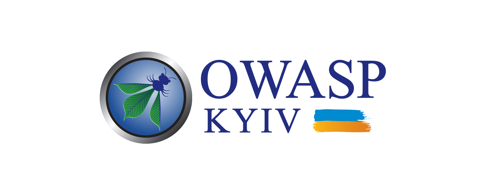

---

layout: col-sidebar
title: OWASP Kyiv
country: Ukraine
region: Europe
meetup-group: kyiv-meetup-group
tags: supporters-tag past2021-tag past2020-tag past2019-tag past2018-tag past2017-tag
level: 0

---

## Future Events



## Who are we

OWASP Kyiv chapter was founded in 2017 by [Vlad
Styran](mailto:vlad.styran@owasp.org) and [Ihor
Bliumental](mailto:ihor.bliumental@owasp.org). The chapter is run by a
team of dedicated cybersecurity enthusiasts: [Kyrylo
Hobrenyak](mailto:kyrylo.hobreniak@owasp.org), [Dmytro
Diordiychuk](mailto:dmytro.diordiichuk@owasp.org),
[Anatolii Bereziuk](mailto:anatolii.bereziuk@owasp.org) and [Serhii
Korolenko](mailto:korolenko.sergiy@owasp.org).

The chapter aims at holding quarterly meetups in the format of 2
practical workshops and up to 5 talks. The meetups are normally streamed
online and recorded, and are followed by unofficial parties in Kyiv
pubs.

## How to find us

Follow our news and announcements on social media:
[Facebook](https://www.facebook.com/owaspkyiv),
[Twitter](https://twitter.com/owaspKyiv) &
[Telegram](https://t.me/OWASP_UA)

Find us on the semi-official OWASP
[Slack](https://owasp.slack.com/messages/chapter-ua/) channel (you have
to
[register](https://owasp.slack.com/join/shared_invite/enQtNDI5MzgxMDQ2MTAwLTEyNzIzYWQ2NDZiMGIwNmJhYzYxZDJiNTM0ZmZiZmJlY2EwZmMwYjAyNmJjNzQxNzMyMWY4OTk3ZTQ0MzFhMDY)
first)

Watch recordings of our previous events
[YouTube](https://www.youtube.com/OWASPKyiv)

Join the chapter [Mailing
List](http://lists.owasp.org/mailman/listinfo/owasp-kyiv) or browse the
[Archives](http://lists.owasp.org/pipermail/owasp-kyiv)

## How to support the chapter

If your company wishes to support the chapter, please contact [Ihor
Bliumental](mailto:ihor.bliumental@owasp.org), [Kyrylo
Hobrenyak](mailto:kyrylo.hobreniak@owasp.org), [Dmytro
Diordiychuk](mailto:dmytro.diordiichuk@owasp.org),
[Anatolii Bereziuk](mailto:anatolii.bereziuk@owasp.org) or [Serhii
Korolenko](mailto:korolenko.sergiy@owasp.org).

## Become a Speaker

Call For Speakers at OWASP Kyiv events is permanently open. If you want
to present at future events, review and agree with the [OWASP Speaker
Agreement](Speaker_Agreement "wikilink") and check for upcoming events
at <https://cfp.owaspukraine.org>, or simply send the title and abstract
of your talk and speaker bio to [Ihor
Bliumental](mailto:ihor.bliumental@owasp.org), [Kyrylo
Hobrenyak](mailto:kyrylo.hobreniak@owasp.org), [Dmytro
Diordiychuk](mailto:dmytro.diordiichuk@owasp.org),
[Anatolii Bereziuk](mailto:anatolii.bereziuk@owasp.org) or [Serhii
Korolenko](mailto:korolenko.sergiy@owasp.org).

## Become a Partner

To become a partner of OWASP Kyiv event, contact [Ihor
Bliumental](mailto:ihor.bliumental@owasp.org), [Kyrylo
Hobrenyak](mailto:kyrylo.hobreniak@owasp.org), [Dmytro
Diordiychuk](mailto:dmytro.diordiichuk@owasp.org),
[Anatolii Bereziuk](mailto:anatolii.bereziuk@owasp.org) or [Serhii
Korolenko](mailto:korolenko.sergiy@owasp.org).

We don't have any special partnership package, however the partner
organization or individual will receive our warm thanks and a fair
amount of gratitude spread over our social media presence, placed at the
chapter official web-page, and announced at the event itself.

## Become a Host

To host an OWASP Kyiv event, contact [Ihor
Bliumental](mailto:ihor.bliumental@owasp.org), [Kyrylo
Hobrenyak](mailto:kyrylo.hobreniak@owasp.org), [Dmytro
Diordiychuk](mailto:dmytro.diordiichuk@owasp.org),
[Anatolii Bereziuk](mailto:anatolii.bereziuk@owasp.org) or [Serhii
Korolenko](mailto:korolenko.sergiy@owasp.org).

Venue requirements include:

  - Capacity to welcome up to 100 attendees
  - Possibility to host a lunch (paid separately by the Chapter)
  - Separate high-quality internet connection for online streaming
  - No need for additional attendee registration or providing attendee
    lists
  - No marketing, advertising, or hiring at the event
