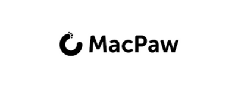

## 2018

### Chapter Meetup Fall 2018

| Hosted by [MacPaw](http://macpaw.com)                                                                                                                             | Sponsored by [HackenProof](http://hackenproof.com)    |
| ----------------------------------------------------------------------------------------------------------------------------------------------------------------- | ----------------------------------------------------- |
|  |  |

**Date** Sep 29, 2018 

**Location** [MacPaw](https://macpaw.com), 81
Antonovycha Street, Kyiv, Ukraine

#### Program

1.  10:00 Serhii Korolenko - XSS from zer0 to Hero (workshop) |
    [Video](https://www.youtube.com/watch?v=mKqc9u_BRLM)
2.  11:30 Eduard Babych - Burp Suite: from First Run to Website Hack in
    60 min (workshop) |
    [Video](https://www.youtube.com/watch?v=GNe9NfEWq0A)
3.  12:30 Oleksii Baranovskyi - BeEF it up (workshop) |
    [Video](https://www.youtube.com/watch?v=V7wx9fMp92s)
4.  14:00 Stanislav Kolenkin - How to Secure Your Kubernetes Cluster |
    [Video](https://www.youtube.com/watch?v=iRB-Jqc5XNs)
5.  15:00 Valentin Averin - AppSec Requirements in PCI DSS |
    [Video](https://www.youtube.com/watch?v=ixAGG_4g9PE)
6.  16:00 Artem Tykhonov - Setting up the Setapp Bug Bounty Program |
    [Video](https://www.youtube.com/watch?v=CSYY90PWuBs)

### Chapter Meetup Summer 2018

| Hosted by [Ciklum](https://www.ciklum.com). | Sponsored by [Linkos Group](http://www.linkos.com.ua). |
| ------------------------------------------- | ------------------------------------------------------ |
|       |                  |

**Date** Jul 14, 2018

**Location** [Sky
Point](https://foursquare.com/v/sky-point-20th-floor/4e809969d3e3d2ec7ec3a5ef)
(Ciklum Kyiv, 20th floor): 12 Amosova street, Horizon Park business
center, Kyiv, Ukraine

#### Program

1.  Stanislav Kolenkin - Kubernetes Security |
    [Video](https://www.youtube.com/watch?v=rcY4ol6Wi90&index=1&list=PLDLqQj8RuUFtNtrorz3R3JA0861QpQXX3)
2.  Stanislav Kolenkin - Practical Kubernetes Security (Workshop) |
    [Video](https://www.youtube.com/watch?v=XiiriQpcKP4&index=2&list=PLDLqQj8RuUFtNtrorz3R3JA0861QpQXX3)
3.  Pavlo Radchuk - Smart Contracts Security: Understanding Token
    Security (Workshop) |
    [Video](https://www.youtube.com/watch?v=BTC2-3LB0uA&index=3&list=PLDLqQj8RuUFtNtrorz3R3JA0861QpQXX3)
4.  Ali Huseyn Aliyev - The Browser Does Not Protect You |
    [Video](https://www.youtube.com/watch?v=BTC2-3LB0uA&index=3&list=PLDLqQj8RuUFtNtrorz3R3JA0861QpQXX3)
5.  Olha Pasko - Security Baseline for Incident Response |
    [Video](https://www.youtube.com/watch?v=YOUmEGWp1is&list=PLDLqQj8RuUFtNtrorz3R3JA0861QpQXX3&index=4)
6.  Yan Kravchenko - Evolution of Application Security Programs and
    OWASP SAMM 2.0 |
    [Video](https://www.youtube.com/watch?v=xijsNetSQUw&list=PLDLqQj8RuUFtNtrorz3R3JA0861QpQXX3&index=5)
7.  Andriy Shalaenko - Intro to JS and Vue.js Sandbox Escape |
    [Video](https://www.youtube.com/watch?v=jFK2TqAkrsY&list=PLDLqQj8RuUFtNtrorz3R3JA0861QpQXX3&index=6)

### Chapter Meetup Spring 2018

**Date** Mar 3, 2018,

**Location** [Sky
Point](https://foursquare.com/v/sky-point-20th-floor/4e809969d3e3d2ec7ec3a5ef)
(Ciklum Kyiv, 20th floor): 12 Amosova street, Horizon Park business
center, Kyiv, Ukraine

#### **Program**

***Morning Workshops***

1.  Serhii Korolenko - Crack The Hash Workshop |
    [Video](https://www.youtube.com/watch?v=YetkDs-wvTE)
2.  Vlad Styran - Pentesting Android Apps |
    [Video](https://www.youtube.com/watch?v=vih61eM3DsA)

***Afternoon Talks***

1.  Vlad Styran - OWASP Kyiv 2017 Results and 2018 Plans |
    [Slides](https://www.slideshare.net/owaspKyiv/vlad-styran-owasp-kyiv-2017-report-and-2018-plans)
    | [Video](https://www.youtube.com/watch?v=iFRT5j5yPsY)
2.  Vlada Kulish - Why So Serial? Threats to Modern Serialization
    Capabilities |
    [Slides](https://www.slideshare.net/owaspKyiv/vlada-kulish-why-so-serial)
    | [Video](https://www.youtube.com/watch?v=QHRBQYSh-aU)
3.  Roman Borodin - ISC2 & ISACA Certifications First-hand Experience |
    [Slides](https://www.slideshare.net/owaspKyiv/roman-borodin-isc2-isaca-certification-programs-firsthand-experience)
    | [Video](https://www.youtube.com/watch?v=w9AA5DKTyKI)
4.  Ihor Bliumental - WebSocket Security |
    [Slides](https://www.slideshare.net/owaspKyiv/ihor-bliumental-websockets)
    | [Video](https://www.youtube.com/watch?v=ucy98JiE-nU)
5.  Oleksii Dorogan - A Struggle to Start a Bug Bounty for a .gov.ua. |
    [Video](https://www.youtube.com/watch?v=pzanY97lcwY)
6.  Yevhen Teleshyk - Phishing Threats to Cloud Users |
    [Slides](https://www.slideshare.net/owaspKyiv/yevhen-teleshyk-oauth-phishing)
    | [Video](https://www.youtube.com/watch?v=zd4PIJSamJY)