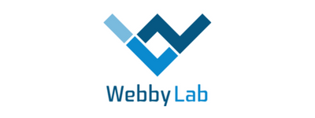

## 2019

### Chapter Meetup Fall 2019

| Hosted by [Grammarly](https://www.grammarly.com/).                                   | Partner: [Trend Micro](https://www.trendmicro.com/).         |
| ----------------------------------------------------------------------- | -------------------------------------------------------------- |
|  |  |

**Date** Nov. 23, 2019

**Location** [Grammarly](https://www.grammarly.com/)
02121, Україна, м Київ, Харківське шосе, 201/203, корпус 2-А, літера Ф

#### Program

[Event
schedule](https://cfp.owaspukraine.org/okf219/schedule/)

1. “Cilium - Network Security for Microservices. Let's See How It Works with Istio“ by Stanislav Kolenkin |
     [Video](https://www.youtube.com/watch?v=D7zcy2wA-4U&list=PLDLqQj8RuUFsxINmeNCEVWDE3mPgpElpu&index=2&t=0s)
2. “Quarantine Nights: exploiting macOS File Quarantine in popular apps“ by Vladimir Metnew |
     [Video](https://www.youtube.com/watch?v=URsOPSTTgc4&list=PLDLqQj8RuUFsxINmeNCEVWDE3mPgpElpu&index=3&t=0s)
3. “Injections - 4 Ways of Penetration” by Evgeny Tolchinsky |
     [Video](https://www.youtube.com/watch?v=g_qUePGoS9o&list=PLDLqQj8RuUFsxINmeNCEVWDE3mPgpElpu&index=4&t=0s)
4. “Pentest Expectations” by Ihor uZ |
    [Video](https://www.youtube.com/watch?v=Vl9M7SmdtTA&list=PLDLqQj8RuUFsxINmeNCEVWDE3mPgpElpu&index=5&t=0s)
5. “Hacktoberfest та open-source” by Mykhailo Pazyniuk |
     [Video](https://www.youtube.com/watch?v=LBxVQ2RdiUE&list=PLDLqQj8RuUFsxINmeNCEVWDE3mPgpElpu&index=6&t=0s)
6. “Basic Ideas of OSINT and Why It Is Useful” by Nadia Klymenko |
     [Video](https://www.youtube.com/watch?v=8-RsF4DeLl4&list=PLDLqQj8RuUFsxINmeNCEVWDE3mPgpElpu&index=7&t=0s)
7. “AppSec Quiz“ by Serhii Korolenko

### Chapter Meetup Summer 2019

| Hosted by [EVO](https://evo.company).                                   | Partner: [Pentest.com.ua](https://pentest.com.ua).         |
| ----------------------------------------------------------------------- | -------------------------------------------------------------- |
|  |  |

**Date** Aug 3, 2019 

**Location** [EVO Company](https://evo.company)
02121, Україна, м Київ, Харківське шосе, 201/203, корпус 2-А, літера Ф

#### Program

[Event
schedule](https://cfp.owaspukraine.org/owaspkyivsummer2019/schedule/)

1.  “Top Mobile Applications Vulnerabilities” by Svyatoslav Login |
    [Video](https://www.youtube.com/watch?v=cb7W1m84-nI&list=PLDLqQj8RuUFuLeumXPNIT3WhRWzR3jXHp&index=1)
2.  Web Application Security Quiz |
     No video
3.  Mitre ATT\&CK in Practice. Detectors, Alerting, Coverage by Den
    Iuzvyk |
    [Video](https://www.youtube.com/watch?v=Fs0F7fnmTIY&list=PLDLqQj8RuUFuLeumXPNIT3WhRWzR3jXHp&index=3)
4.  “How to Find Security Vulnerabilities in Python Applications?” by
    Andrey Shalaenko |
    [Video](https://www.youtube.com/watch?v=OJXZh3z0nLs&list=PLDLqQj8RuUFuLeumXPNIT3WhRWzR3jXHp&index=5)
5.  “Как manual QA может протестировать проект со стороны security +
    XSS” by Evgeny Tolchinsky |
    [Video](https://www.youtube.com/watch?v=NnmjZLGyw_A&list=PLDLqQj8RuUFuLeumXPNIT3WhRWzR3jXHp&index=2)
6.  Ruby Security Tips - Roman Rott |
    [Video](https://www.youtube.com/watch?v=FV6s8tUJQSs&list=PLDLqQj8RuUFuLeumXPNIT3WhRWzR3jXHp&index=7&t=0s)

### Chapter Meetup Spring 2019

| Hosted by [Ciklum](https://www.ciklum.com). | Partner: [WebbyLab](https://webbylab.com).  |
| ------------------------------------------- | ----------------------------------------------- |
|       |  |

**Date** Apr 6, 2019 

**Location** [Sky
Point](https://foursquare.com/v/sky-point-20th-floor/4e809969d3e3d2ec7ec3a5ef)
(Ciklum Kyiv, 20th floor): 12 Amosova street, Horizon Park business
center, Kyiv, Ukraine

#### Program

[Event
schedule](https://cfp.owaspukraine.org/owaspkyivspring2019/schedule/)

1.  All about Subdomain Takeover attack - Workshop (Kostiantyn
    Sanduliak) | [Video](https://youtu.be/Uvw_o-RHmJA)
2.  Overview of iOS apps security assessment - Workshop (Dmytro
    Diordiichuk) | [Video](https://youtu.be/mIKBdkvWg_s)
3.  Shooting yourself in the feet with PHP (Taras Sharkadi) |
    [Video](https://youtu.be/phGrjNpfevc)
4.  Your web application is vulnerable\! (Dmytro Naumenko) |
    [Video](https://youtu.be/p6QnZ4WkBNo)
5.  OWASP Mobile Security Testing Guide (MSTG) in Real Life (Julia
    Potapenko) | [Video](https://youtu.be/BTkXlsTQtlI)
6.  Adversarial attacks on Deep Neural Networks (Andrey Shalaenko) |
    [Video](https://youtu.be/xET3S0Z-N9s)

### Chapter Meetup Winter 2019

| Hosted by [InnoHub](https://www.facebook.com/InnoHubUA/) | Partner: [Berezha Security](https://berezhasecurity.com)        |
| -------------------------------------------------------- | ------------------------------------------------------------------- |
|                 |  |

**Date** Feb 2, 2019 

**Location**
[InnoHub](https://www.facebook.com/InnoHubUA/), 6-z, Vatslava Havela
Blvd, Kyiv, Ukraine, 03124

#### Program

[Event
schedule](https://cfp.owaspukraine.org/owaspkyivwinter2019/schedule/)

1.  10:00 Web Application Firewall bypass techniques - **Workshop**
    (Bohdan Lukin) |
    [Video](https://www.youtube.com/watch?v=zfBT7Kc57xs)
2.  11:40 Subdomain discovering as an essential part of the
    reconnaissance phase - **Workshop** (Kostiantyn Sanduliak) |
    [Video](https://www.youtube.com/watch?v=fUbJBZmIJag)
3.  13:20 Introduction lstio Service Mesh (Stanislav Kolenkin) |
    [Video](https://www.youtube.com/watch?v=-jttmV4dHbg)
4.  14:50 OWASP Top-10 A2: Broken Authentication (Svyatoslav Login) |
    [Video](https://www.youtube.com/watch?v=yUKplWXeuOk)
5.  15:40 Email as an initial attack vector (Arthur Hil) |
    [Video](https://www.youtube.com/watch?v=qprq5J5FT8s)
6.  16:30 Building SQL firewall: insights from developers (Artem
    Storozhuk) | [Video](https://www.youtube.com/watch?v=vF0bJFBgnxg)
7.  17:20 Application Threat Modeling (Vlad Styran) |
    [Video](https://www.youtube.com/watch?v=1IeY4eXo3W4)
