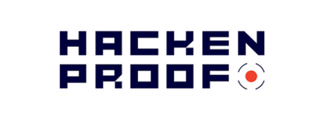
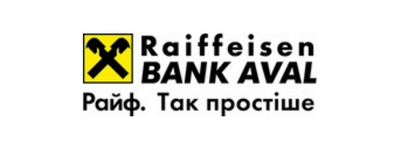
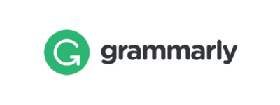
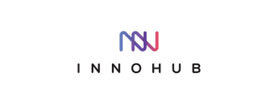

## Our supporters

### Chapter meeting sponsors

These companies have demonstrated their support for Ukrainian
Application Security community by funding our quarterly chapter
meetings.

      

### Chapter meeting hosts

These companies have demonstrated their support for Ukrainian
Application Security community by hosting our quarterly chapter
meetings.

     
